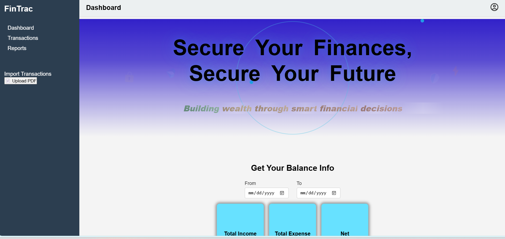

# finance_tracker

## Getting Started

Follow these steps to run the project locally.

---

### Prerequisites

- **Node.js & npm**  
  ≥ v16.x (includes npm) — https://nodejs.org/

- **MongoDB**  
  - Community Edition running on `localhost:27017`, or  
  - Atlas connection string  

- **Git**  
  ≥ 2.x — https://git‑scm.com/downloads

---

## 1. Clone the Repository

```bash
# Replace with your repo URL
git clone https://github.com/<YOUR_USERNAME>/<YOUR_REPO>.git
cd <YOUR_REPO>
````

## 2. Configure Environment Variables

In the project root, create a file named `.env`:

```ini
# MongoDB
MONGO_URI=mongodb://127.0.0.1:27017/Personal_financial_tracking

# JWT configuration
JWT_SECRET=your_jwt_secret_here
JWT_EXPIRES_IN=2h
````

## 3. Install Dependencies
**a) Server (project root)**
````bash
npm install
````
Installs backend libraries:

express — HTTP framework

mongoose — MongoDB ODM

dotenv — env var loader

jsonwebtoken — JWT auth

multer — file uploads

pdf-parse — extract text from PDFs

tesseract.js — OCR for images

cors — Cross‑origin requests

nodemon (dev) — auto‑restart server

**Client (React app)**
````bash
cd client
npm install
````
Installs frontend libraries:

react, react-dom — UI

react-router-dom — routing

axios — HTTP client

recharts — charts

## 4. Available Scripts
From the project root:

**Start the backend**
````bash
npm run server
# or
npx nodemon server.js
````
**Start the frontend**
````bash
cd client
npm start
````

## 5. Usage
 1. Open your browser at http://localhost:3000 

 2. Register a new account or log in 

 3. Dashboard: view income/expense summary, hover cards, trend & category charts 

 4. Transactions: add manually or upload receipt image / PDF to import 

 5. Reports: monthly & quarterly tables and category breakdowns


## 7. Tech Stack & Key Libraries
Layer	Technologies & Key Packages
---
- **Backend :	express, mongoose, dotenv, jsonwebtoken, multer, pdf-parse, tesseract.js, cors, nodemon**

- **Frontend :	react, react-dom, react-router-dom, axios, recharts, concurrently**

- **Dev Tools :	Git, Node.js, npm**

## Demo Video
You can watch the demo video here:  
[](https://raw.githubusercontent.com/AmarKale13/finance_tracker/main/assets/demo_FinTrac.mp4)

## ✨ Features

### ✅ User Authentication
- Secure **registration** and **login**
- Uses **JWT (JSON Web Token)** for protected routes
- Passwords securely stored using hashing

---

### 💰 Transaction Management
- **Add**, **view**, and **delete** transactions
- Support for both **income** and **expenses**
- Upload pdf of transactions
- Each transaction includes:
  - Date
  - Amount
  - Type (Income / Expense)
  - Category
  - Optional note

---

### 📤 Upload & Parse Receipts
- Upload **image (JPG/PNG)**
- Automatically extract:
  - Amount
  - Date
  - Category
  - Note
- Uses:
  - `tesseract.js` for OCR (image receipts)
  - `pdf-parse` for digital PDFs

---

### 📊 Dashboard & Analytics
- Interactive **Dashboard** includes:
  - Total Income, Expense, and Net balance (hover-reveal cards)
  - Line chart showing trends over time
  - Pie charts for category-wise income & expenses

---

### 📆 Date Range Selection
- Filter dashboard analytics by **custom time range**
- Dynamically updates charts & summaries

---

### 📈 Reports Section
- Monthly & Quarterly summaries:
  - Total Income, Expense, Net Balance
- Category breakdown for each month/quarter

---

### 📥 Upload Bulk Transactions
- Upload **PDF bank statements** in tabular format via sidebar
- Each row becomes a transaction in MongoDB

---

### 🧾 Paginated Transaction List
- Paginated transaction history
- Each entry shown as a responsive **card**
- Built-in delete functionality

---

### ⚙️ Modern Tech Stack
- **React** frontend with `react-router-dom` for SPA routing
- **Express + MongoDB** backend with `mongoose`
- `axios` for API calls
- `recharts` for data visualization
- `multer`, `pdf-parse`, and `tesseract.js` for file handling & parsing

---

### 🧪 Developer Friendly
- Organized folder structure
- Uses `.env` for environment variables
- Development via `nodemon`, `concurrently` for multi-service startup
- Easily extendable for future features like budgets, recurring transactions, etc.


